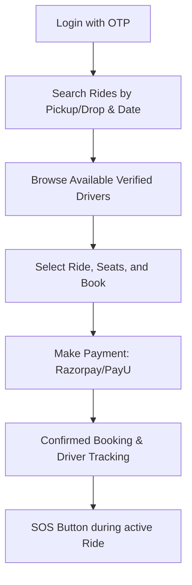
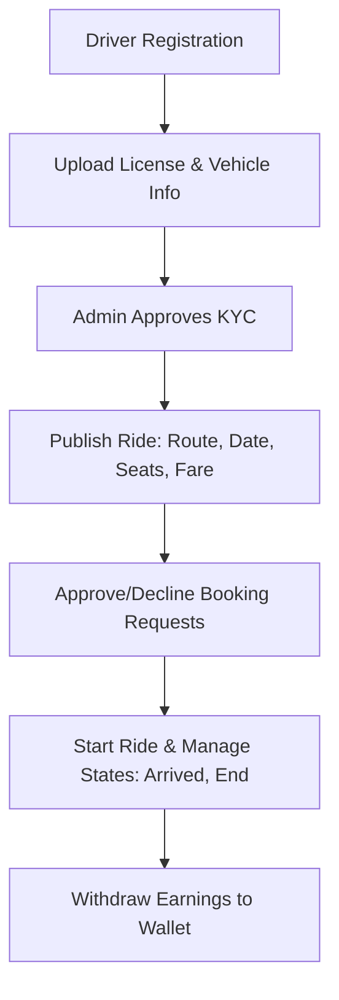

# Operations & User Flows Guide - KrishRide

This guide details how to seed the Admin user on both backend stacks, and outlines step-by-step how the Driver and Customer flows function in the KrishRide platform.

---

## 1. How to Seed the Admin User

Before administrators can log in to the admin panel (`react-frontend/src/pages/admin`), an admin user record must exist in the database.

### Option A: Node.js Backend (`node-backend/`)
We have a custom TypeScript seeder script to create/promote admin users.

1. Navigate to the Node backend directory:
   ```bash
   cd node-backend
   ```
2. Execute the seeder script using `npx tsx` and provide the required arguments (Phone Number, First Name, Last Name, Email):
   ```bash
   npx tsx scripts/create-admin.ts 9999999999 "Avinash" "Chidiurala" "admin@hushryd.com"
   ```
   - **Note**: The script automatically formats the phone number (adds `+91` prefix) and checks for duplicates. If a regular user already exists with that number, it elevates them to the `admin` role and assigns dashboard permissions.

### Option B: Spring Boot Backend (`springboot-backend/`)
The Spring Boot backend has an automatic `AdminSeeder` component.

1. Upon starting the Spring Boot application using `./mvnw spring-boot:run`, the `AdminSeeder.java` runs automatically.
2. It checks the `adminRepository` count. If no admins exist, it creates a default admin:
   - **Mobile**: `+919999999999`
   - **Email**: `admin@hushryd.com`
   - **Role**: `admin`
   - **Permissions**: `ALL`
3. You can modify these default values in `springboot-backend/src/main/java/com/hushryd/backend/config/AdminSeeder.java` before launching the app.

---

## 2. Customer Panel & Ride Booking Flow

The Customer panel allows users to request intercity and local rides, make payments, track drivers in real-time, and call for emergency support.

### Step-by-Step Flow:


1. **OTP Login**:
   - The user enters their mobile number and receives an OTP (simulated or via Twilio).
   - Once logged in, the application determines the user role as `customer`.

2. **Search Rides (`/find-ride`)**:
   - Customers input a **Pickup Location** and **Drop Location** (powered by Google Places Autocomplete).
   - Select the date and number of seats required.
   - Click **Search Rides** to fetch available departures.

3. **Booking Details**:
   - View list of matches showing the driver's name, vehicle type, rating, departure time, and fare.
   - Click on a ride to view detailed route maps, pickup instructions, and estimated arrival times.
   - Click **Proceed to Book**.

4. **Payment Processing**:
   - Payments are handled via secure payment portals (Razorpay/PayU).
   - Once payment is successful, the backend records the transaction and marks the seats as booked.

5. **Live Tracking & Ride Details**:
   - View active bookings on the Customer Dashboard (`/customer/dashboard`).
   - Click **Track Ride** to load a live Google Map displaying the driver's current coordinates using WebSockets.

6. **SOS (Emergency) Action**:
   - If the customer feels unsafe during the trip, they can trigger the **SOS Button**.
   - This sends immediate emergency alerts to the Admin dashboard and triggers twilio SMS alerts to registered emergency contacts.

---

## 3. Driver Panel & Ride Publishing Flow

The Driver panel allows car owners to publish departures, verify their credentials (KYC), accept booking requests, and manage active rides.

### Step-by-Step Flow:


1. **Registration & KYC Upload (`/driver/kyc`)**:
   - Upon logging in as a driver, the user must complete their profile.
   - Drivers upload their **Driver's License**, **Aadhar Card**, and **Vehicle Registration Document**.
   - Input vehicle specifics: model, color, license plate, and total seats.
   - The profile remains in a `PENDING` state until verified by an administrator.

2. **Publishing a Ride (`/driver/publish-ride`)**:
   - Once KYC is approved, the driver can host rides.
   - Go to **Publish Ride** and fill in:
     - Route points (Pickup, intermediate stops, Drop).
     - Date, Departure Time, and Fare per seat.
     - Available passenger seats.
   - Once published, the ride is visible to searching customers.

3. **Managing Booking Requests**:
   - Drivers receive real-time notifications when customers book seats.
   - In the Driver Dashboard (`/driver/dashboard`), the driver can review the rider's details and **Approve** or **Decline** the request.

4. **Executing the Ride (`/driver/active-ride`)**:
   - When the departure time arrives, the driver clicks **Start Ride**.
   - The driver updates statuses along the route:
     - **Arrived at Pickup** (notifies the rider).
     - **Trip Started** (initiates live tracking).
     - **Trip Ended** (finalizes payment collections and frees up seats).

5. **Earnings & Wallet (`/driver/wallet`)**:
   - Once a ride completes, the payment gets credited to the driver's internal wallet.
   - Drivers can view total payouts and request bank transfers from their earnings page.

---

## 4. Admin Panel & Dashboard Flow

Administrators use the web panel (`react-frontend/src/pages/admin`) to oversee the platform's operations. The landing view is the **Admin Dashboard** (`/admin/dashboard`), which aggregates stats and maps actions.

### 4.1 How the Admin Dashboard Works

When the dashboard page mounts, it queries the backend API using two main services:
1. **`adminApi.getDashboardStats()`**: Retrieves current business indicators.
2. **`adminApi.getRecentActivity()`**: Fetches details about new signups and active records.

#### UI Sections:
- **Stats Card Grid**: Displays five KPI boxes:
  - **Total Users**: Overall active account registrations (drivers and riders).
  - **Total Rides**: Number of scheduled departures.
  - **Completed Bookings**: Bookings that finished successfully.
  - **Cancelled Bookings**: Help identify system drop-off rates.
  - **Revenue**: Total earnings from commissions, formatted in **Indian Rupees (INR)** (e.g., `₹5,000.00`) dynamically using `Intl.NumberFormat('en-IN')`.
- **Quick Actions Hub**: Provides navigation cards to management sections (Manage Users, Manage Rides, View Finance) with hover and slide transitions.
- **Recent Activity Live Tables**: Displays three live tables showing the latest updates:
  - **Recent Users**: Displaying Name, Role (blue/green chips for Driver/Customer), and Registration Date. Clicking takes you directly to the User Details page (`/admin/users/:id`).
  - **Recent Rides**: Showing Driver name, departure route (pickup ➔ drop), and creation date.
  - **Recent Bookings**: Displaying Customer name, status (Success/Error/Primary color-coded chips), and booking date.

---

### 4.2 Extended Admin Features

- **KYC Approvals (`/admin/kyc`)**: Dedicated review page displaying drivers' uploaded licenses, cards, and vehicle specifications. Click "Approve" to unlock their profile or "Reject" with a feedback reason.
- **SOS Alarm Hub (`/admin/sos`)**: Receives WebSocket alerts if a rider or driver triggers an SOS on the mobile app. Plays an alarm, displays real-time GPS coordinates, vehicle registration details, and emergency contacts.
- **Support Tickets (`/admin/support`)**: Helpdesk dashboard to categorize, answer, and close complaints or platform bugs reported by users.
- **Finance & Payouts (`/admin/payouts`)**: Approves manual bank withdrawals requested by drivers from their local wallets.
